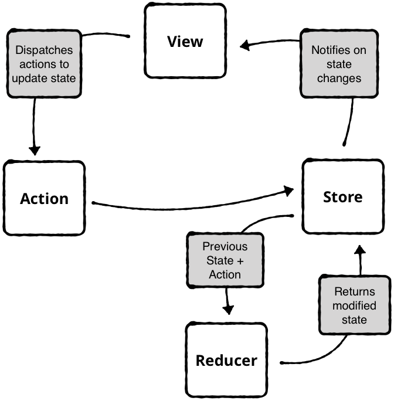

# Architecture patterns

## React
React is an un-opinionated framework in the front-end ecosystem. Its versatile nature does not provide a way to organize and structure a web application. The way an application is organized and structured is how a developer or a team of developers interact with it. A project with no logical structure means that everyone can do whatever they want inside it. A well-structured project requires developers to think deeper about their implementation and at the same time keep things organized. It also makes the codebase easy to navigate, modify and scale to add new features.

The architecture of a project is essential. An organized codebase is how a team of developers gets productive within the given structure in the long run. In this article, let’s look at some of the ways to keep the lifecycle of a React application healthy and well organized and what patterns you can follow.

## Redux?
Redux is an architecture in which all of your app’s state lives in one container. The only way to change state is to create a new state based on the current state and a requested change.

The Store holds all of your app’s state.

An Action is immutable data that describes a state change.

A Reducer changes the app’s state using the current state and an action.

## Babel
Babel compiles JavaScript code, to JavaScript code. Not so complicated, right?
It needs to do it because there are different versions of the JavaScript engines and developers want to use bleeding edge code syntax and functionality but also supporting old JavaScript engines running on older browsers or Node.js versions.

## Webpack
At its core, webpack is a static module bundler for modern JavaScript applications. When webpack processes your application, it internally builds a dependency graph from one or more entry points and then combines every module your project needs into one or more bundles, which are static assets to serve your content from.

## Jest
Jest is a JavaScript testing framework designed to ensure correctness of any JavaScript codebase. It allows you to write tests with an approachable, familiar and feature-rich API that gives you results quickly. Jest is well-documented, requires little configuration and can be extended to match your requirements. Jest makes testing delightful.

## Typescript
TypeScript adds additional syntax to JavaScript to support a tighter integration with your editor. Catch errors early in your editor.

TypeScript code converts to JavaScript, which runs anywhere JavaScript runs: In a browser, on Node.js or Deno and in your apps.

TypeScript understands JavaScript and uses type inference to give you great tooling without additional code.

## ES Lint
ESLint statically analyzes your code to quickly find problems. It is built into most text editors and you can run ESLint as part of your continuous integration pipeline.

---

[Back to README overview](../README.md)
